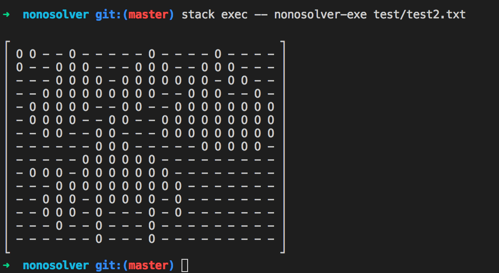

# nonosolver
1. `stack build`
2. `stack exec -- nonosolver-exe <test case>`
test cases are stored in test directory
## test cases
test case are formatted as from top row to bottom row each line hints for that row
partitioned with a character 'e'
then from left to right column hints
ending with a character 'e' and empty line

