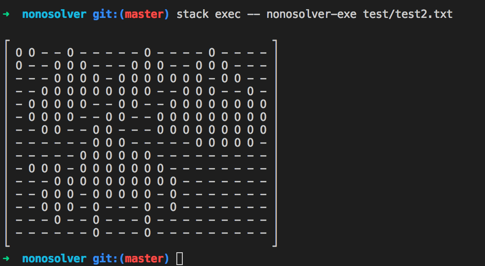
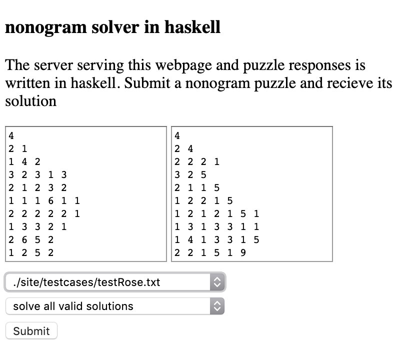
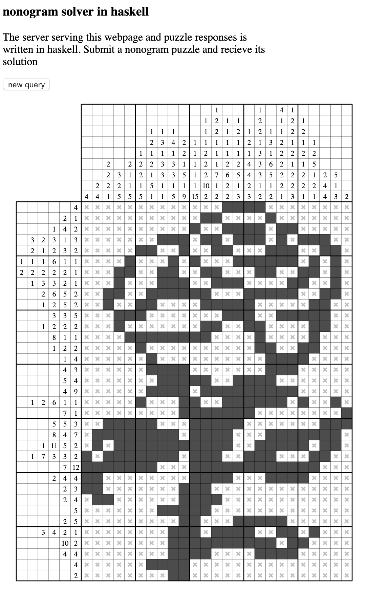
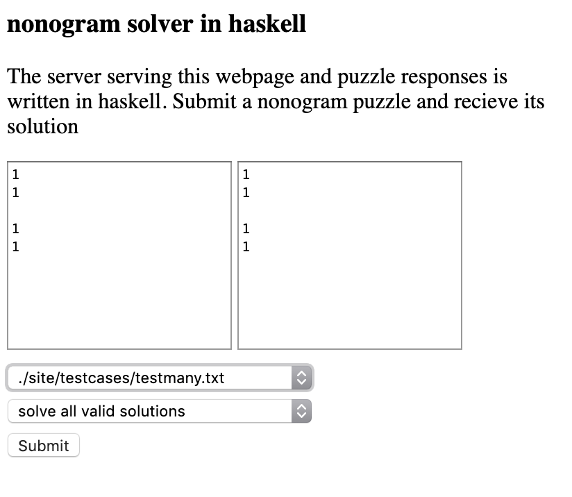
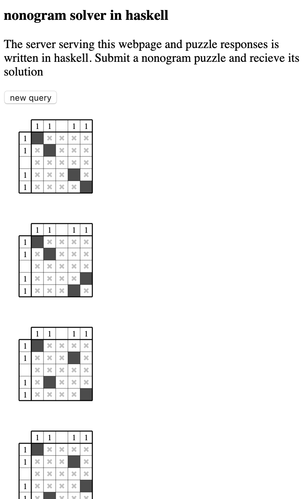

# nonosolver
## file main running on console
1. `stack build`
2. `stack exec -- nonosolver-exe <test case>`
test cases are stored in `site/testcases` directory


## http server
### to run
```sh
stack build
stack exec nonosolver-exe
```
### to use
1. fill in test case
2. press submit










### textbox input
The first textbox expects input of the following format: each line are row hints starting from the top row and each line hints space separated. First textbox are for rows, second are for columns.

### testcase file format
similar to the textbox input format for the first textbox, followed by a line containing only the character `e`, followed by the second textbox input and another line of `e`.

## Google Cloud Kubernetes Workload Deployment
If running docker locally, use
```Dockerfile
docker build -t nonosolver .
docker run -p 80:80 nonosolver
```